# ui-styleguide
Style guide for Web Application layout (HTML)

## Table of Contents

1. [UI Libraries](#ui-libraries)
1. [UI Controls](#ui-controls)
1. [Layout](#layout)
1. [Navigation](#navigation)
1. [Search Pages](#search-pages)
1. [Data Entry Pages](#data-entry-pages)
1. [Reports](#reports)
1. [Security](#security)
1. [User Preferences](#user-preferences)

## UI Libraries

### Technical Concerns

###### [Style [U001](#style-u001)]

- Treat all component updates as a program change. i.e. do not "update" a package just to get the latest version

*Why?*: Program changes are only done to add functionality or fix an issue.  Arbitrary changes without a conscious reason will at best do nothing, and at worse result in an outage

###### [Style [U002](#style-u002)]

- All components not part of the application must be described by a metadata file, e.g. package.json

*Why?*: allows use of tools e.g. NPM to retrieve new versions if needed

*Why?*: important to ensure all developers are using the same version of the component, or at the least are able to easily determine what version should be used

###### [Style [U003](#style-u003)]

- Do not check 3rd-party components into project repositories

*Why?*: Large components such as entity framework and others can take up ten's of megabytes across thousands of files, causing the repository to bloat.   

###### [Style [U004](#style-u004)]

- Do not modify 3rd-party components.  Use additional files to configure or override such components, or at the very least create a fork of the component

*Why?*: Will make updating a component nearly impossible without breaking application functionality.  

###### [Style [U005](#style-u005)]

- Use minified versions of JS components in Production

*Why?*: The client must download each JS file used, and minification can significantly reduce the size of the file, increasing application performance

### Current Libraries

###### [Style [U006](#style-u006)]

- Use Bootstrap version 3.x as our primary CSS framework

*Why?*: Bootstrap provides the most straightforward approach to a clean, professional-looking UI

*Why?*: Bootstrap 4.x is still in Alpha as of August 2016

*Why?*: Want to be ready to optimize sites for mobile

## UI Controls

###### [Style [U050](#style-u050)]

- Navigation links must allow right-click behavior to open a new tab or window

*Why?*: Expected user behavior

###### [Style [U051](#style-u051)]

- Dropdown lists must use the `Select2` combobox library

*Why?*: Provides autocomplete support

*Why?*: Provides clean behavior when entering search text (avoids typing in the middle of the selected item)

###### [Style [U052](#style-u052)]

- Dropdown lists must include a typeahead feature

*Why?*: Makes it easier to select from a long list of potential choices

*Why?*: Not harder to add than the standard input

###### [Style [U053](#style-u053)]

- Use `<table>` for standard grids

*Why?*: Simple and fast

###### [Style [U054](#style-u054)]

- Use `SlickGrid` for interactive search pages and large data sets

*Why?*: Efficient at handling large data sets

*Why?*: Works well with filter-by-column pattern (each column in displayed table includes own filter)

###### [Style [U055](#style-u055)]

- All Date / time fields must use a time picker

*Why?*: Allows user to enter the time or choose from a list

*why?*: Prevents malformed dates

###### [Style [U056](#style-u056)]

- Use `bootstrap` modal popups

*Why?*: Allows data entry / other controls vs. simple OK/Cancel option

### Provisional

###### [Style [U057](#style-u057)]

- Use `??????` for date / time dropdowns

*Why?*: Option #1 - picker.js (seems to be more optimized for mobile)

## Layout

###### [Style [U100](#style-u100)]

- Top level layout should consist of single-column variable width

*Why?*: Let children pages define side bars as necessary

*Why?*: Allow search pages to fit full width of viewport 

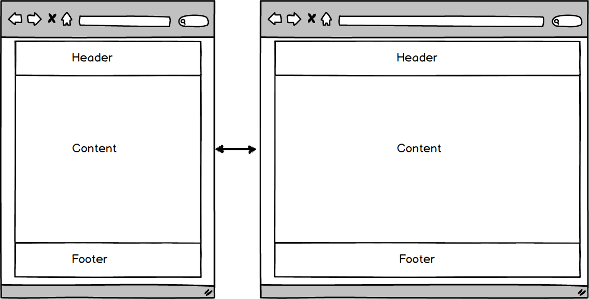

###### [Style [U101](#style-u101)]

- Data Entry pages should use a fixed column max width of ~ 960 px

*Why?*: Allow for 2 documents side by side on 1920x1080p monitor

###### [Style [U102](#style-u102)]

- Application must include a menu bar at top of page at all times

*Why?*: User must have access to primary navigation interface at all times

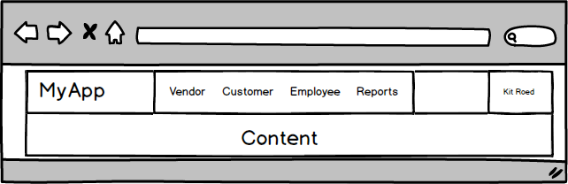

###### [Style [U103](#style-u103)]

- Include application name / logo on far LH side of menu bar

*Why?*: Easily identify the application user is looking at

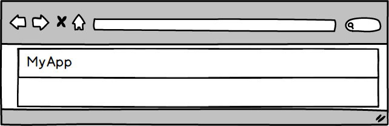

###### [Style [U104](#style-u104)]

- Logged in user should appear on the RH side of menu bar

*Why?*: Ensure user is running application under proper credentials.  

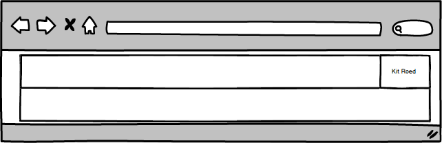

###### [Style [U105](#style-u105)]

- Clicking on logged in user name should display dropdown menu include
    - settings
    - Log Out (when not using Windows Authentication)

*Why?*: Need a location for user-specific options/actions 

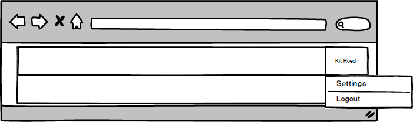

###### [Style [U106](#style-u106)]

- Current app build, date, commit, and database version should be displayed in the application footer

*Why?*: See critical application metadata at glance for informational purposes or in diagnosing bugs / configuration problems

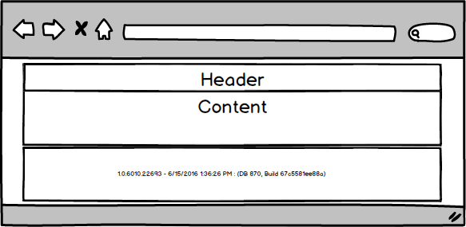

###### [Style [U107](#style-u107)]

- Use header/detail layout pattern for primary application entities e.g. a vendor having info, contacts, materials, payments, etc. 

*Why?*: Once the user locates an entity, they should be able to easily view all information about that entity

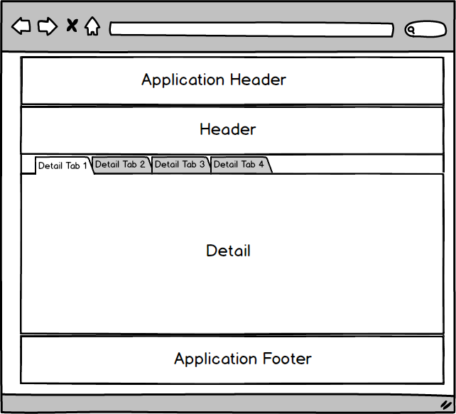

## Navigation

###### [Style [U150](#style-u150)]

- Menu bar must contain top-level navigation at all times

*Why?*: Easier for user to move around application / reduces number of navigation clicks

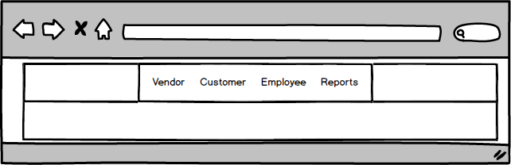

###### [Style [U151](#style-u151)]

- Page-specific menu options must be between site logo and top-level navigation

*Why?*: Arbitrarily placing these to the beginning, middle, or end of main navigation will confused users - be consistent

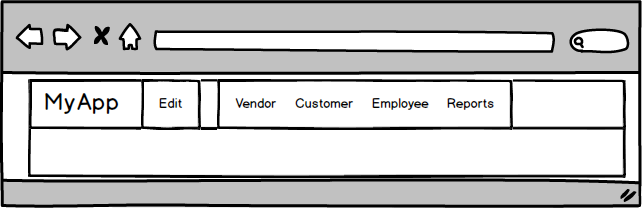

###### [Style [U152](#style-u152)]

- Query string must not contain any primary key values - only domain-specific codes (may require composite parameters)

*Why?*: Users do not understand what a primary key is, and may confuse this with similar user codes e.g. Customer Account 50000 uses primary key 48000

*Why?*: Users tend to associate specific meaning with displayed values - purpose of primary key is to provide uniqueness and referential integrity - meaning they should never be updated directly.  

good:  `http://myapp/customer/account=456888`

good:  `http://myapp/product/code=8844&size=quart`

Bad:  `http://myapp/customer/custid=15000`

###### [Style [U153](#style-u153)]

- Query string must uniquely select an entity, or reliably choose an appropriate entity.

*Why?*: Having the same parameters cause different entities to load is confusing and will very likely result in data quality issues.  

###### [Style [U154](#style-u154)]

- Clicking on site logo should return user to main page

*Why?*: Provide consistent way to get back to the main page.  

###### [Style [U155](#style-u155)]

- Minimize the number of sub-menu's in the main menu bar

*Why?*: minimize user clicks

### Provisional

###### [Style [U000](#style-u000)]

- Float the menu bar at the top of the page when scrolling

*Why?*: Allow users to easily access edit and navigation options on "tall" pages

## Search Pages

###### [Style [U200](#style-u200)]

- Search results should be exportable to CSV

*Why?*: Simple way to give users "data access" to system

###### [Style [U201](#style-u201)]

- Standard searches should finish within 5000ms

*Why?*: Better user experience

*Why?*: Longer searches can place unnecessary load on the server, or indicate poorly optimized queries.  

###### [Style [U202](#style-u202)]

- Certain long searches are allowed provided they can complete in 30-60 seconds

*Why?*: Some searches requiring data across many entities will naturally take longer, but can be very useful to users (e.g. cross reference basic sales history with products).  Remember though that this is primarily an OLTP system, and some types of searches are better served with OLAP / offline queries

###### [Style [U203](#style-u203)]

- Long searches must display a waiting / loading message while the search is running.  Should give the user an option to cancel the search

*Why?*: Users need a visual indication the program is "working"

*Why?*: Don't hold the user "prisoner" by making them wait for a long search (they may have realized they entered too broad of a search

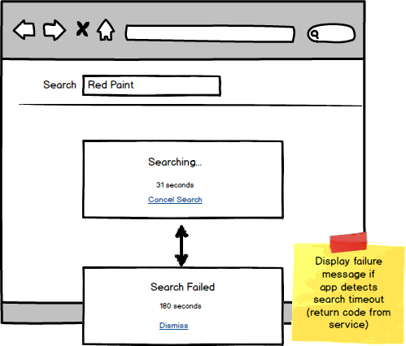

###### [Style [U204](#style-u204)]

- Search timeouts should not crash the current page. If the max timeout it hit, the user should be given an appropriate error message

*Why?*: Searches can timeout for many reasons, and the application needs to anticipate these.  

###### [Style [U205](#style-u205)]

- Default page size should be a minimum of 50 items, with a dropdown to allow the user to select 25,50,100,500 or Unlimited

*Why?*: A good default should fill the entire visible page.  

*Why?*: Giving the user an option to show more balanced performance with user convenience

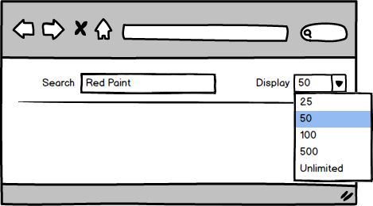

###### [Style [U206](#style-u206)]

- Column headings should be sortable

*Why?*: Sorting is often a useful secondary filtering technique

###### [Style [U207](#style-u207)]

- Search filters should not take up more than 25% of the visible page, otherwise provide a collapsible filter panel

*Why?*: Devote more screen real-estate to the actual search results.  

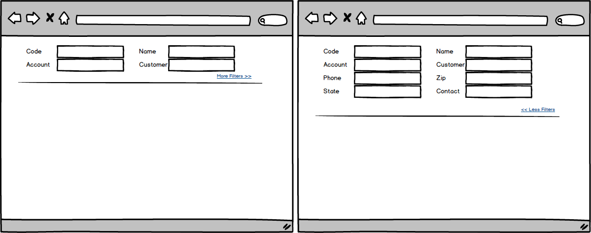

###### [Style [U208](#style-u208)]

- Display total number of search results (not on current page, but for the entire filter)

*Why?*: Count of items is almost always useful and relevant information for the user

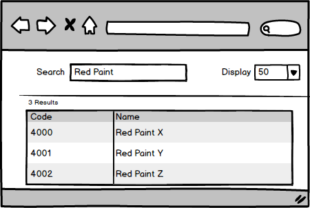

###### [Style [U209](#style-u209)]

- Displayed entities should have a hyperlink to open the appropriate master/detail page over the identifying code (vs an "open" button)

*Why?*: Each row should already contain an identifying value to distinguish from other results.

*Why?*: do not need an additional column dedicated to opening the item

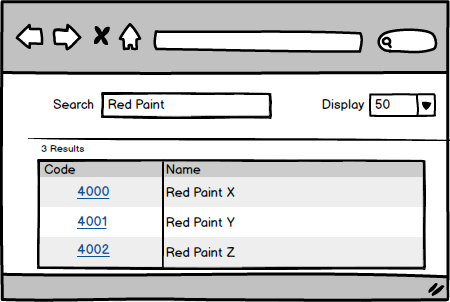

###### [Style [U210](#style-u210)]

- Current filter/search values should be visible in query string

*Why?*: Allows user to bookmark current search

*Why?*: Allows other areas of the application (or outside the application) to display targeted search results

good: `http://myapp/productsearch/q=Red%20Paint`

###### [Style [U211](#style-u211)]

- Searches should be GET requests vs POST requests

*Why?*: We are not providing information to the server, we are requesting that the service return a result set that conforms to specified parameters.  

## Data Entry Pages

###### [Style [U250](#style-u250)]

- Users should be able to save work using ctrl+s keystroke

*Why?*: near-universal keyboard shortcut users understand

###### [Style [U251](#style-u251)]

- All work in edit mode must be atomic - save/cancel as a unit.

*Why?*: User needs to trust that the system won't change permanent state until they click "save"

###### [Style [U252](#style-u252)]

- Users should be alerted before doing any action that will cause them to lose unsaved work. (note, do not alert if no changes, even if in edit mode)

*Why?*: Do not want users to accidentally lose changes because of unintended action

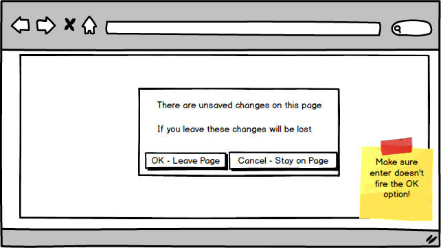

###### [Style [U253](#style-u253)]

- use `boostrap` `warning` and `error` classes for validation

*Why?*: Must show fields failing validation rules

###### [Style [U254](#style-u254)]

- Use dynamic panel at TOP of form to display validation failures 

*Why?*: Need a consistent place to display validation messages

*Why?*: tooltips are unreliable and useless on mobile browsers

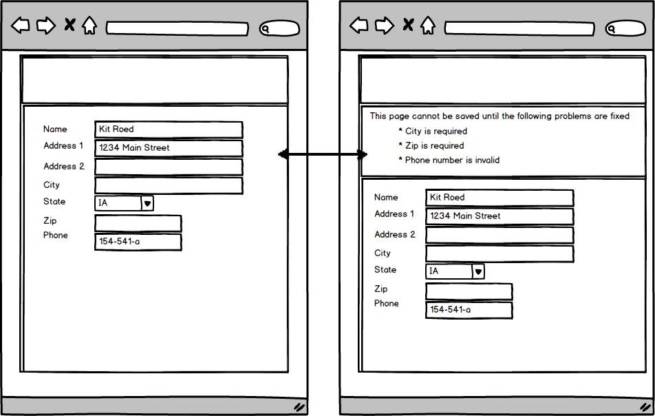

###### [Style [U255](#style-u255)]

- Controls must display appropriate `warning` and `error` classes if they fail validation immediately (after user leaves the control)

*Why?*:User should see all existing validation errors so they understand what they need to fix.  

###### [Style [U256](#style-u256)]

- Users must be able to do a full edit cycle using the keyboard

*Why?*: Keyboard entry is generally the fastest data entry mechanism, and requiring mouse clicks greatly slows down this process

###### [Style [U257](#style-u257)]

- Every data entry page must include an edit menu including edit, save, cancel options

*Why?*: Basic CRUD functionality that should be consistent between pages

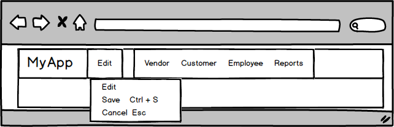

###### [Style [U258](#style-u258)]

- Explicitly specify spellcheck attribute on text `<input>`'s and `<textarea>`

*Why?*: Users used to spellcheck in their email, word processing applications

###### [Style [U259](#style-u259)]

- Enable typeahead for all lookup data (via lookup tables or related entities).  For non-standard lookup, create a dynamic lookup based on distinct values within that particular column. 

*Why?*: Helps user to select the correct codes / options for the particular field

###### [Style [U260](#style-u260)]

- Users should be able to clone an entity into a new entity (where possible)

*Why?*: Many entities are repeated with minor variations, and this greatly reduces the amount of data entry work required per entity.  

###### [Style [U261](#style-u261)]

- Users should be given the option of a "bulk" data entry mode (where possible / feasible)

*Why?*: Users often need to add several items at once, or change values across several entities, and this can save the user time.

###### [Style [U262](#style-u262)]

- Page should show when the entity was last updated / created and last user to update

*Why?*: Basic auditing data that can help quickly answer questions about the entity (e.g. did something change recently?)

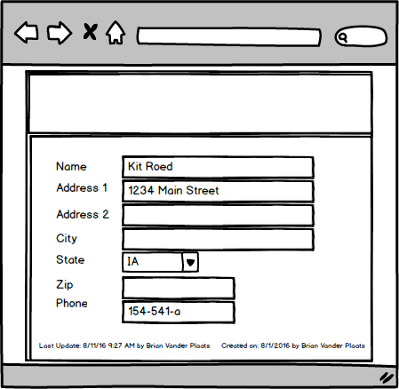

###### [Style [U263](#style-u263)]

- Pages must *not* be allowed to double-submit post data

*Why?*: Very common source of duplicate/bad data

###### [Style [U264](#style-u264)]

- When on the last cell of a row's grid, hitting enter starts a new row

*Why?*: Default behavior in Excel

###### [Style [U265](#style-u265)]

- if user enters any data into a row, form should treat it as a new line, do not require a user to click "new line"

*Why?*: Any time user enters data in save mode, they will assume it will go thru unless they receive a warning - requiring a click is a subtle way for data loss (that the user might not catch)

###### [Style [U266](#style-u266)]

- Keyboard shortcuts should be displayed next to menu items, or via tooltips on save/edit/cancel buttons (note - avoid re-purposing standard [shortcuts](https://en.wikipedia.org/wiki/Table_of_keyboard_shortcuts))

*Why?*: Allows user to more easily discover the existence of keyboard shortcuts 

## Reports

###### [Style [U300](#style-u300)]

- All Reports must include the date printed

*Why?*: User needs to understand the age of the printed data

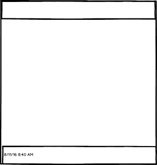

###### [Style [U301](#style-u301)]

- All reports must include the report file / template in the footer

*Why?*: Needed to quickly locate the appropriate source file of the report

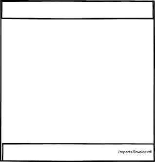

###### [Style [U302](#style-u302)]

- All Reports should show page X of Y in the footer.  

*Why?*: Needed to inform the user how many pages they have, and where they are in the stack. 

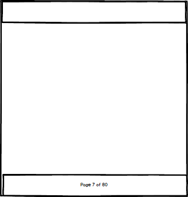

## Security

###### [Style [U350](#style-u350)]

- Do not show links, controls, functions, etc that a user does not have access to

*Why?*: Simplify complex applications for users

*Why?*: Most people will have what they need to do their job

###### [Style [U351](#style-u351)]

- Each application must have a site-wide message / page to display to a user that does not have access to the site. 

*Why?*: Need to explain to user what application they are accessing so they can request access if necessary

###### [Style [U352](#style-u352)]

- Page URL's must be secured so that if the user gets a link to a page they do not have access to, they are re-routed to an accessed denied page.  

*Why?*: user may have a bookmark or receive a link - do not assume that they are accessing from a button or hyperlink on the page.  

*Why?*: user may try to craft a custom url

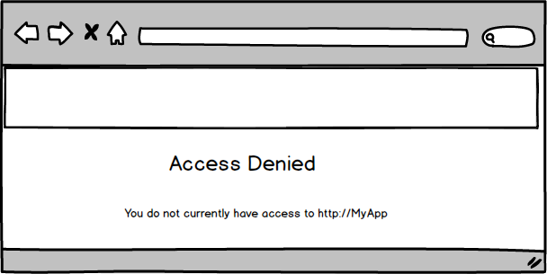

###### [Style [U353](#style-u353)]

- Access denied page should include a link / function to request access

*Why?*: Convenience for the user

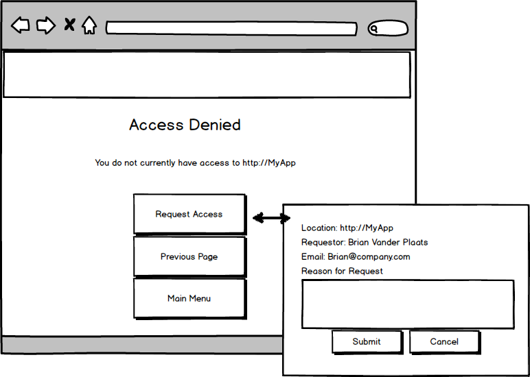

###### [Style [U354](#style-u354)]

- Access denied page should include a link to go back to previous page or main application menu

*Why?*: Convenience for the user

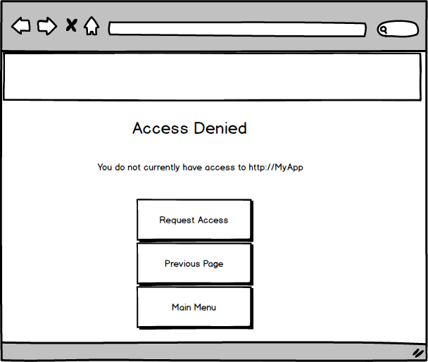

###### [Style [U355](#style-u355)]

- Horizontal - access to specific routes / functions - should be specified by application roles.  Roles can secure several routes, but a route may only be secured by a single role

*Why?*: Specifying security by route results in dozens of securable items - resulting in less security as no one has time to manage all these

*Why?*: Broad roles simplify user security management.  When granularity is required, new roles can readily be created.

*Why?*: Specifying multiple roles per route complicates security management - better to create a new unique role for this need if a single, existing role does not fit

###### [Style [U356](#style-u356)]

- Each application should have at least one role, `View_Myapp_Role` that determines if a user can even load the application. 

*Why?*: Need a basic handle for securing access to an application

###### [Style [U357](#style-u357)]

- Vertical - access to specific routes / functions - meaning a subset of entities such as Edit Customers, but only west coast customers - should be handled via custom security tables linked to appropriate groups

*Why?*: Using roles for vertical data would result in dozens or hundreds of new roles

*Why?*: Tying security to handles within the data e.g. Customer Territory, means the security approach is always relevant to the current data.  

## User Preferences

###### [Style [U400](#style-u400)]

- Users should be able to select default setting relevant to their department or location

*Why?*: Corporate-wide data systems are powerful in that all data is in one system, but provides challenges for users who may only ever be interested in a subset of this information. 

*Why?*: Specifying the same information in filters is redundant for the user

*Why?*: Prevent user from accidentally creating / updating entities in an unrelated area (e.g. entering a new order at the wrong factory)

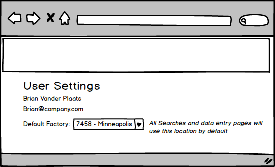

###### [Style [U401](#style-u401)]

- Users should be able to specify a default landing page other than the main menu, possibly with a default search.  

*Why?*: Application use can vary greatly between users, there is no one-size fits all landing page.  

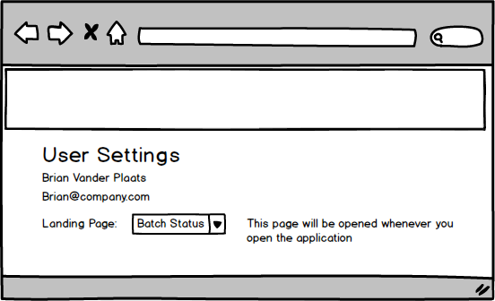

###### [Style [U402](#style-u402)]

- Store current user profile settings in a cookie

*Why?*: Settings change infrequently, and can affect every page - do not require an additional back end hit to load data
